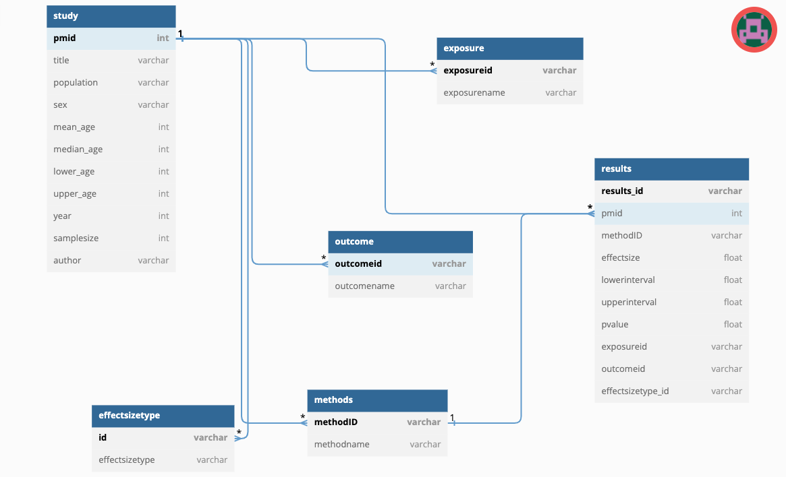

# Streamlit_MRevidenceentryapp

This repo contains the code for creating a GUI entry form to populate the database with data extracted from the literature of both MR and RCT papers.

Here is an image of the entity relationship diagram (ERD) showing the database schema in details.

## List of tools
- python 3
- streamlit
- sqlite3

## Install the tools using conda on mac M1
    #Check that the code below matches your OS

streamlit:  `conda install -c conda-forge streamlit`

sqlite3:  `conda install -c blaze sqlite3`

python: `conda install python=3`

To replicate my working environment including the packages and their versions in mac M1 clone the environment using the code below:

    `conda env create -n cloned-mr_rct_env -f mr_rct_environment.yaml`
