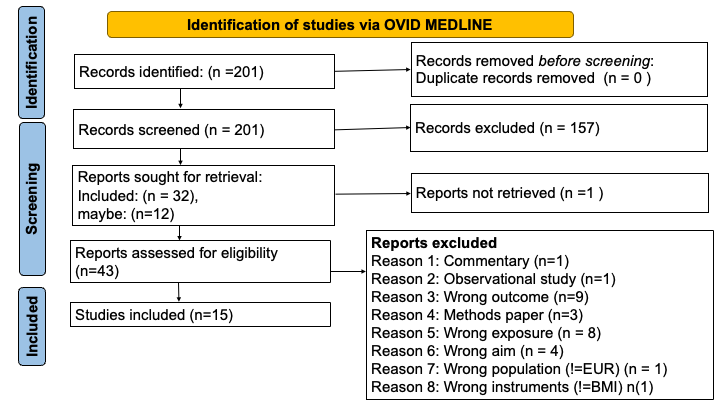

```{r setup, include=FALSE,message=FALSE, warning=FALSE, error=FALSE}
knitr::opts_chunk$set(echo = FALSE)
```


```{r setwd, echo=FALSE}

setwd("~/OneDrive - University of Bristol/Winfred_PhDApps/Streamlit_MRevidenceentryapp/")
```

 
 
# Introduction  
Mendelian randomization an approach that uses measured variation in genes to determine the causal effect of exposure on outcomes (*Davey Smith 2003*). MR studies are not biased by reverse causality since genes are constant and not modified by disease edevlopment.  

Obesity is a major driver of cardiometabolic disorders in the general population. It has immense clinical and economic consequences including cost of medication and absenteeism from work leading to great loss incurred by employers (*Apovian et al*).
In the past decades the prevalence of hypertension has increased. Besides, its a major risk factor for cardiovascular diseases and occurs alongside other cardiovascular disease risk factors to cause disease.

The aim of this study was to conduct a systematic literature review and metanalyses of MR studies to determine the causal role of higher BMI on hypertension, systolic and diastolic blood pressure.

# Methods  

## Literature retrieval, inclusion and exclusion criteria  
We searched  Medline on OvidSP for Mendelian randomization studies using the query (search terms) on 30th November 2022.

Papers were eligible for inclusion if they reported estimates from MR analysis specifically of genetically predicted adulthood BMI on hypertension, systolic  or diastolic blood pressure.
We excluded reviews, letters, commentary, articles of opinion and papers looking at childhood BMI.


## Data extraction  

We extracted and entered the data in predefined tables. From each MR study we extracted: the first author name, year of publication, title of the study, total sample size including cases and controls for binary outcomes, the exposure name, the outcome name, the number of instruments variables, the source of these SNPs, the ancestry of the study population and the causal estimates including mean difference (MD), odds ratios, beta estimates with 95% confidence intervals and standard errors where applicable.  

### PRISMA Workflow 

```{r Flow chart, fig.align='center',fig.cap="**Figure 1:** Flow chart of study selection", echo=FALSE}
#

```


## Load the libraries. 

```{r Load the right libraries,echo=FALSE}
library(metafor)
library(tidyverse)
library(ggplot2)
library(plotly)
library(patchwork)
library(gridExtra)
library(Rclean)
library(DT)
```

## Read in the data. 

```{r Read in the data, echo=FALSE}
dat1 <- read.csv("BMI_Hypertension_SBP_DBP_MRevidencecsv.txt",header = TRUE,sep = "\t")
#make a unique id without resultsid to takeup the y-axis
dat1$ID <- paste(dat1$author,dat1$pmid.y,dat1$year, sep = "_")
```

## Define helper functions. 

```{r scaling the odds ratio to sd scale, echo = TRUE}
scale_or <- function(data, estimate, lowerbound, upperbound,
    sd) {
    data_modified <- data %>%
        mutate(OR_LI = round(exp((((log(estimate)/log(10)) -
            (1.96 * (((log(upperbound) - log(lowerbound))/(2 *
                1.96))/sqrt(3)))) * sd) * log(10)),
            digits = 2)) %>%
        mutate(OR_UI = round(exp((((log(estimate)/log(10)) +
            (1.96 * (((log(upperbound) - log(lowerbound))/(2 *
                1.96))/sqrt(3)))) * sd) * log(10)),
            2)) %>%
        mutate(oddsratio = round(exp(((log(estimate)/log(10)) *
            sd) * log(10)), 2))
    return(data_modified)
}

duplicate_subset <- function(data, estimate, lowerbound,
                             upperbound, sd) {
  data_duplicatedcolumns <- data %>%
    mutate(OR_LI = lowerbound) %>%
    mutate(OR_UI = upperbound) %>%
    mutate(oddsratio = estimate)
  return(data_duplicatedcolumns)
}

# Wes Spiller 2022 - calculate the confidence
# intervals given point estimates and pvalue only
CI_calc_lower <- function(est, p) {
  z = -0.862 + sqrt(0.743 - 2.404 * log(p))
  se = est/z
  lower_interval = est - (1.96 * se)
  return(lower_interval)
}

CI_calc_upper <- function(est, p) {
  z = -0.862 + sqrt(0.743 - 2.404 * log(p))
  se = est/z
  upper_interval = est + (1.96 * se)
  return(upper_interval)
}

#make a forest plot using ggplotly
forest_plot <- function(dat1,x,y,xmin,xmax,
                        title = " ",xlab =" ", ylab = " ",colour,xintercept){
  plot <- dat1 %>% 
    ggplot(.)+
    geom_segment(aes(x = {{x}}, y={{y}},yend={{y}},xend={{x}}))+
    geom_point(aes(x = {{x}}, y={{y}},color = colour))+
    geom_errorbarh(aes(xmin={{xmin}},xmax={{xmax}},y={{y}},height = .2))+
    labs(title=title, x=xlab, y =ylab ) +
    geom_vline(xintercept=xintercept, color=colour, linetype='dashed', alpha=.5)+
    theme_classic()
  return(plot)
}

## Metaanalysis
MR_metaanalysis <- function(dat, method, measure) {
  dat$logor <- log(dat$oddsratio)
  dat$SE <- (log(dat$OR_UI) - log(dat$OR_LI))/(2 *
                                                 qnorm(0.025))
  mr_meta <- rma(yi = dat$logor, sei = dat$SE, method = method,
                 measure = measure)
  return(mr_meta)
}
#Plot results of metanalysis
forest_plot_meta <- function(meta_res, dat, refline, xlab = " ") {
  forest(meta_res, header = "Author_PMID_Year", pch = 16,
         cex = 0.75, xlab = xlab, transf = exp, refline = refline,
         slab = dat$ID, xlim = c(-16, 10), at = seq(-2,
                                                    3, by = 1), ilab = cbind(dat$samplesize,
                                                                             dat$NO_ofIVs), ilab.xpos = c(-5, -1), order = "obs")
  text(c(-5, -1), 10, c("Sample size", "No of IVs"),
       cex = 0.75, font = 2)
  text(-16, -1, pos = 4, cex = 0.75, bquote(paste("RE Model (Q = ",
                                                  .(formatC(meta_res$QE, digits = 2, format = "f")),
                                                  ", df = ", .(meta_res$k - meta_res$p), ", p = ",
                                                  .(formatC(meta_res$QEp, digits = 2, format = "f")),
                                                  "; ", I^2, " = ", .(formatC(meta_res$I2, digits = 1,
                                                                              format = "f")), "%)")))
}

```

## Data wrangling

```{r explore the data, echo=FALSE}
# head(dat1) Hypertension, odds ratio
P1 <- dat1 %>%
  arrange(ID) %>%
  filter(effectsizetype_id == "ID1" & OUTCOMEID ==
           "O1" & exposurenotes == "Adult" & outcomenotes !=
           "Gestational hypertension" & outcomenotes !=
           "Incident hypertension" & population == "EUR" &
           AnalysisType == "Main" & EXPOSURE == "BMI")

# Subset1 consist of entries that need scaling
subset1 <- P1 %>%
  filter(sd != 0)
# subset1 Subset2 consist of entries that need
# not scaling
subset2 <- P1 %>%
  filter(sd == 0)
# subset2 Scaling
subset1 <- scale_or(data = subset1, estimate = subset1$effectsize,
                    lowerbound = subset1$lowerinterval, upperbound = subset1$upperinterval,
                    sd = subset1$sd)
subset2 <- duplicate_subset(data = subset2, estimate = subset2$effectsize,
                            lowerbound = subset2$lowerinterval, upperbound = subset2$upperinterval,
                            sd = subset2$sd)
# Combine the two subsets
Total <- rbind(subset1, subset2)
# Total

# Systolic blood pressure, Beta estimates
P2 <- dat1 %>%
  arrange(ID) %>%
  filter(effectsizetype_id == "ID4" & OUTCOMEID ==
           "O2" & AnalysisType == "Main" & exposurenotes ==
           "Adult" & EXPOSURE == "BMI")

# Calculate lower and upper intervals given a
# point estimate and a pvalue
Wes_2022 <- P2 %>%
  filter(pmid.y == 35947639) %>%
  mutate(lowerinterval = CI_calc_lower(effectsize,
                                       pvalue)) %>%
  mutate(upperinterval = CI_calc_upper(effectsize,
                                       pvalue))

P2_less_Wes_2022 <- P2 %>%
  filter(pmid.y != 35947639)

# row bind the two dataframes
P2 <- rbind(Wes_2022, P2_less_Wes_2022)
# subset the data P2 scale the Beta effect
# estimates in place
P2[P2$sd != 0, ]$effectsize = P2[P2$sd != 0, ]$effectsize *
  P2[P2$sd != 0, ]$sd
P2[P2$sd != 0, ]$lowerinterval = P2[P2$sd != 0, ]$lowerinterval *
  P2[P2$sd != 0, ]$sd
P2[P2$sd != 0, ]$upperinterval = P2[P2$sd != 0, ]$upperinterval *
  P2[P2$sd != 0, ]$sd

# Diastolic blood pressure,Beta estimates
P3 <- dat1 %>%
  arrange(ID) %>%
  filter(effectsizetype_id == "ID4" & OUTCOMEID ==
           "O3" & AnalysisType == "Main" & exposurenotes ==
           "Adult" & EXPOSURE == "BMI")

P3[P3$sd != 0, ]$effectsize = P3[P3$sd != 0, ]$effectsize *
  P3[P3$sd != 0, ]$sd
P3[P3$sd != 0, ]$lowerinterval = P3[P3$sd != 0, ]$lowerinterval *
  P3[P3$sd != 0, ]$sd
P3[P3$sd != 0, ]$upperinterval = P3[P3$sd != 0, ]$upperinterval *
  P3[P3$sd != 0, ]$sd

# Hypertension; risk difference
P4 <- dat1 %>%
  arrange(ID) %>%
  filter(effectsizetype_id == "ID5" & OUTCOMEID ==
           "O1" & AnalysisType == "Main" & exposurenotes ==
           "Adult" & EXPOSURE == "BMI")
# Results expressed as increase in unit BMI
# percentage point. Thus: multiply by sd and
# divide by 100
P4[P4$sd != 0, ]$effectsize = P4[P4$sd != 0, ]$effectsize *
  P4[P4$sd != 0, ]$sd/100
P4[P4$sd != 0, ]$lowerinterval = P4[P4$sd != 0, ]$lowerinterval *
  P4[P4$sd != 0, ]$sd/100
P4[P4$sd != 0, ]$upperinterval = P4[P4$sd != 0, ]$upperinterval *
  P4[P4$sd != 0, ]$sd/100

# Diastolic blood pressure, risk difference
P5 <- dat1 %>%
  arrange(ID) %>%
  filter(effectsizetype_id == "ID5" & OUTCOMEID ==
           "O3" & AnalysisType == "Main" & exposurenotes ==
           "Adult" & EXPOSURE == "BMI")

# 1SD increase in BMI increases 0.145 SD of DBP.
# Thus:
P5[P5$sd != 0, ]$effectsize = P5[P5$sd != 0, ]$effectsize *
  P5[P5$sd != 0, ]$sd
P5[P5$sd != 0, ]$lowerinterval = P5[P5$sd != 0, ]$lowerinterval *
  P5[P5$sd != 0, ]$sd
P5[P5$sd != 0, ]$upperinterval = P5[P5$sd != 0, ]$upperinterval *
  P5[P5$sd != 0, ]$sd

```


# Results  

## Odds ratio  
### Hypertension 
Genetically predicted BMI was associated with increased risk for hypertension.
We excluded **incident and gestational hypertension** from the analysis and limited the analysis to European population only denoted by **EUR**.  

Louise AC Millard paper reports their findings in terms of 1 SD higher BMI genetic risk score (SD increase in BMI allelic score equates to 0.64kg/m^2 increase in BMI). Original SD in the UKBiobank is 4.77kg/m^2. We scaled the estimates to 1 SD scale, 1 SD =  (4.77/0.64 = 7.45).

Tove Fall, we have included the prevalent hypertension as the main findings and not ever hypertension since it has a very small sample size, using 1 SNP at FTO locus (one unit increase in BMI(kg/m^2). The results are expressed in terms of per unit increase in BMI 1 kg/m^2. To convert the estimates to  1 SD scale, we converted the odds ratio to beta scaled that using 1 SD = 4.62 kg/m^2 and transformed back to odds ratio.  

Sussana et al, Study revolved around UKBiobank, to convert the estimates from per unit increase in BMI 1kg/m^2  to 1 SD scale, sd = 4.77kg/m^2.  

To scale the odds ratio to uniform scale of 1 SD, we converted the ORs to beta estimates, scale the beta estimates and revert to odds ratio.    


```{r fig.align='center', fig.cap= "**Figure 2:** Forest plot showing results of genetically predicted BMI in relation to hypertension. The results are scaled to 1 SD increase of BMI. Analyses includes individuals of European ancestry only", echo=FALSE}
## Odds ratio Hypertension
plot1 <- forest_plot(Total, x = oddsratio, y = reorder(ID,
                                                       -year), xmin = OR_LI, xmax = OR_UI, title = "Forest plot based on odds ratio",
                     xlab = "Odds ratio (95% CI) per SD increase in BMI",
                     ylab = "Author_PMID_Year", colour = "red", xintercept = 1)
plot1 <- ggplotly(plot1)
plot1
```

```{r}
datatable(Total[, c(53,2,56,54,55,7,49)],colnames = c("Author_PMID_Year","DOI","Estimate","Lowerinterval","Upperinterval","No.of IVs","Samplesize"),class = 'cell-border stripe',caption = "Table 1: Table showing the Author, PMID and Year, DOI,estimates and CIs, number of instrument variables and samplesize.")
```
  
What is the meaning of this plot?  
Of the 7 studies that are reporting MR results of hypertension, the evidence therefore shows that genetically predicted higher adulthood BMI is associated with increased risk for hypertension as shown on **Figure 2**.

This metaanalysis found consistent results of higher genetically predicted BMI and increased risk for hypertension **Figure 7**.
Unlike Martin et al with inflated causal estimates the other papers are consistent even when with as low as 1 instrument; the case of Fall et al 2013.

Louise et al used BMI genetic allelic score which is an instrument of lifelong BMI (exposure) instead of BMI at a given age. However we converted the scale to SD to match the rest of the papers.  

## Beta coefficient  
### Systolic blood pressure  
Genetically predicted BMI is associated with an increase in systolic blood pressure.  
Beta coefficient is the degree of change of an outcome variable for every 1 unit change in the predictor/exposure variable. T-test assesses whether beta is significantly different from zero.  
Beta coefficient is positive, interpretation is that for every 1-unit increase in the predictor variable, the outcome will increase by the beta coefficient value.
Beta coefficient is negative, interpretation is that for every 1-unit increase in the predictor variable, the outcome will decrease by the beta coefficient value.

Nicholas et al adjusted for antihypertensive use by adding 10 mm Hg to SBP.
Nicholas et al reported the effect estimates as change in blood pressure in mm Hg per 10% increase in BMI. Transform the scale form 10% to per 1 SD increase in BMI(Kg/m2). i) Divide the estimates with 10 and multiply by 4.27 Kg/m^2, which is the sd of BMI in the Danish population.  

Tove fall et al, adjusted for hypertensive medication. Tove Fall et al 2015; multiply the estimates by 4.62 to convert it to per 1 SD of BMI.  

Giontella et al adjusted for medication using a stepped addition method where the additional value to scale estimate the BP correctly was based on number of medication taken ranging from 1 to 4 medications.(Malmo Diet and Cancer  cohort). While in Malmo Preventive Project cohort, 15 and 10 mmHg was added to SBP and DBP to correct for antihypertensive treatment since number of medications was not available. Giontella et al, we selected the Malmo Diet and Cancer as our main results with sample size of about ~29k vs malmo preventive project ~9k. They have reported their results in terms of per 1 SD.   

Spiller et al 2018, constructed instruments form GIANT consortium on UKBiobank. They have constructed a weighted allelic score from the 96 SNPs and used this as a single strong instrument compared to using individual SNPs. They were comparing use of MRGXE with IVW in the presence of pleiotropy, MRGXE gives unbiased estimates. The limitation is that this sensitivity analysis method is only applicable to when we have access to individual level data.  
Spiller et al 2022; They report the estimates and the P-values only. We calculated the confidence intervals by first calculating the z, then calculate the SE and finally calculate the CI at 95%. To scale both results to per SD of BMI, we have multiplied the estimates and their intervals by 4.77Kg/m^2; the SD of BMI in UKBiobank.  

```{r fig.align='center', fig.cap= "**Figure 3:** Forest plot showing results of genetically predicted BMI in relation to Systolic blood pressure. The results are scaled to per 1 SD. Analyses includes individuals of European ancestry only"}
plot2 <- forest_plot(P2, x = effectsize, y = reorder(ID,
                                                     -year), xmin = lowerinterval, xmax = upperinterval,
                     title = "Forest plot based on beta estimates",
                     xlab = "Systolic blood pressure change in mmHg per SD increase in BMI (Kg/m2)",
                     ylab = "Author_PMID_Year", colour = "red", xintercept = 0)

plot2 <- ggplotly(plot2)
plot2
```

```{r}
datatable(P2[, c(53,2,12,13,14,7,49)],colnames = c("Author_PMID_Year","DOI","Estimate","Lowerinterval","Upperinterval","No.of IVs","Samplesize"),class = 'cell-border stripe',caption = "Table 2: Table showing the Author, PMID and Year, DOI,estimates and CIs, number of instrument variables and samplesize.")
```

What do the results imply?  
This plot shows results of effects of genetically predicted adulthood BMI on systolic blood pressure. The beta coefficients are scaled to per 1 SD increase in BMI (Kg/m^2). There is clear evidence that for every one SD increase in genetically predicted BMI (Kg/m^2) is associated with an increase in systolic blood pressure. This implies that a reduction in BMI  potentially results to a reduction in systolic blood pressure. Wes Spiller et al 2022, is slightly different from the rest of the values since they are using MR-G estimation under no interaction with unmeasured selection (MR-GENIUS) which relies upon analogous assumptions to MR-GxE.
The observed difference could arise from bias due to violations arising from one or more unmeasured interactions.  

### Diastolic blood pressure  

For every 1 SD increase in genetic predisposition to BMI , diastolic blood pressure increases by this beta coefficient value.
Nicholas et al adjusted for antihypertensive use by adding 5 mm Hg to DBP.  
```{r fig.align='center', fig.cap= "**Figure 4:** Forest plot showing results of genetically predicted BMI in relation to Diastolic blood pressure. The results are scaled to per 1 SD. Analyses includes individuals of European ancestry only"}
plot3 <- forest_plot(P3, x = effectsize, y = reorder(ID,
                                                     -year), xmin = lowerinterval, xmax = upperinterval,
                     title = "Forest plot based on beta estimates",
                     xlab = "Diastolic blood pressure change in mmHg per one SD increase in BMI (Kg/m^2)",
                     ylab = "Author_PMID_Year", colour = "red", xintercept = 0)

plot3 <- ggplotly(plot3)
plot3
```

```{r}
datatable(P3[, c(53,2,12,13,14,7,49)],colnames = c("Author_PMID_Year","DOI","Estimate","Lowerinterval","Upperinterval","No.of IVs","Samplesize"),class = 'cell-border stripe',caption = "Table 3: Table showing the Author, PMID and Year, DOI,estimates and CIs, number of instrument variables and samplesize.")
```
   
What does this mean?    
For every 1 SD increase in genetically predicted BMI (Kg/m^2) is associated with DBP. This implies that lowering the BMI will lead to a reduction in DBP.  

## Risk difference  
### Hypertension  

```{r fig.align='center', fig.cap= "**Figure 5:** Forest plot showing risk difference of genetically predicted BMI in relation to Hypertension. . Analyses includes individuals of European ancestry only"}
plot4 <- forest_plot(P4, x = effectsize, y = reorder(ID,
                                                     -year), xmin = lowerinterval, xmax = upperinterval,
                     title = "Forest plot based on risk difference",
                     xlab = "Risk difference (95% CI) per SD increase in BMI",
                     ylab = "Author_PMID_Year", colour = "red", xintercept = 0)

plot4 <- ggplotly(plot4)
plot4
```
   
```{r}
datatable(P4[, c(53,2,12,13,14,7,49)],colnames = c("Author_PMID_Year","DOI","Estimate","Lowerinterval","Upperinterval","No.of IVs","Samplesize"),class = 'cell-border stripe',caption = "Table 4: Table showing the Author, PMID and Year, DOI,estimates and CIs, number of instrument variables and samplesize.")
```
   
### Diastolic blood pressure  

This figure 6 below shows that genetic predisposition to higher BMI is associated with a higher risk for higher DBP. These are results of a single paper and we will not proceed to perform a metaanalysis.  

```{r fig.align='center', fig.cap= "**Figure 6:** Forest plot showing risk difference of genetically predicted BMI in relation to Diastolic blood pressure. . Analyses includes individuals of European ancestry only"}
plot5 <- forest_plot(P5, x = effectsize, y = reorder(ID,
                                                     -year), xmin = lowerinterval, xmax = upperinterval,
                     title = "Forest plot based on risk difference",
                     xlab = "Diastolic blood pressure change in mmHg per one SD unit of BMI",
                     ylab = "Author_PMID_Year", colour = "red", xintercept = 0)
plot5 <- ggplotly(plot5)
plot5
```
```{r}
datatable(P5[, c(53,2,12,13,14,7,49)],colnames = c("Author_PMID_Year","DOI","Estimate","Lowerinterval","Upperinterval","No.of IVs","Samplesize"),class = 'cell-border stripe',caption = "Table 5: Table showing the Author, PMID and Year, DOI,estimates and CIs, number of instrument variables and samplesize.")
```
  
Notes from Carlos et al:  

The table is correct, those are risk differences.  
A (causal) Risk Difference of a unit increase in D is defined as:
E[Y(d+1)] - E[Y(d)] 
In linear models \tau equals the Risk Difference of a one unit increase in the treatment, that is:
\tau = E[Y(d+1)] - E[Y(d)] 
Formula (1) is an identification result of traditional MR/IV. It says that \tau is identified by the ratio of two regression coefficients.  
Here BMI is standardized, so the Risk Difference tells you how much a one standard deviation increase in BMI increases the risk of DBP.
All variables are standardized, so for DBP we have the 1 standard deviation increase in BMI increases 0.145 standard deviations of DBP.  
   

## Metaanalysis  

We performed metaanalysis where the effect estimates measure had adequate number of studies more than 1 study. We can not perform metaanalysis of outcome DBP and hypertension where MR estimates reported as risk difference since it includes only one study.  

### Metaanalysis of studies that investigated genetic predisposition to higher BMI on the risk of hypertension  

We performed metaanalysis of studies reporting on risk for hypertension as a result of increased genetically preicted BMI. MR estimates reported as odds ratios. We have not performed metaanalysis with regards to SBP and DBP, It is not clear how to specify that measure within metafor package.  


```{r metanalysis of studies invetsigating the causal relationship between higher BMI and hypertension}
### Metaanalysis of studies that investigated
### genetic predisposition to higher BMI on the
### risk of hypertension

p1 <- MR_metaanalysis(Total, method = "REML", measure = "OR")

summary(p1)
confint(p1)
```
  
Metaanalysis results show that genetically predicted higher BMI is associated with increased risk for hypertension (Figure 7). This is consistent across studies.  

```{r fig.align='center', fig.cap= "**Figure 7:** Metaanalysis results for genetically predicted BMI in relation to hypertension. The results are scaled to 1 SD increase of BMI.Analyses includes individuals of European ancestry only"}
forest_plot_meta(meta_res = p1, dat = Total, refline = 1,
            xlab = "Odds Ratio")

```
  
### Metaanalysis of studies that investigated genetic predisposition to higher BMI on SBP  
```{r metanalysis of studies looking at systolic blood pressure,echo=FALSE}
P2$SE <- (P2$upperinterval - P2$lowerinterval)/(2 *
                                                  qnorm((1 - 0.95)/2))  #calculate standard error of beta
res <- rma(yi = P2$effectsize, sei = P2$SE, method = "REML",
           measure = "GEN")
summary(res)
confint(res)

```
  
The metaanalysis shows that genetic predisposition to higher BMI is associated with higher systolic blood pressure. The results were consistent across the studies with 4 studies reporting slighlty smaller changes in SBP.  

```{r fig.align='center', fig.cap= "**Figure 8:** Metaanalysis results for genetically predicted BMI in relation to systolic blood pressure. The results are scaled to 1 SD increase of BMI. Analyses includes individuals of European ancestry only"}
# systolic blood pressure in mmHg
forest(res, xlim = c(-16, 12), ilab = cbind(P2$samplesize,
                                            P2$NO_ofIVs), ilab.xpos = c(-5, -1), slab = P2$ID,
       cex = 0.75, header = "Authors_PMID_Year", xlab = "Beta coefficients",
       order = "obs")  #,dat = P2,refline = 0, xlab = 'Beta coefficient' )
text(c(-5, -1), 10, c("Sample size", "No of IVs"))
text(-16, -1, pos = 4, cex = 0.75, bquote(paste("RE Model (Q = ",
                                                .(formatC(res$QE, digits = 2, format = "f")), ", df = ",
                                                .(res$k - res$p), ", p = ", .(formatC(res$QEp,
                                                                                      digits = 2, format = "f")), "; ", I^2, " = ",
                                                .(formatC(res$I2, digits = 1, format = "f")), "%)")))
```
  
### Metaanalysis of studies that investigated genetic predisposition to higher BMI on DBP  
```{r metanalysis of studies looking at diastolic blood pressure}
### Metaanalysis of studies that investigated
### genetic predisposition to higher BMI on DBP

P3$SE <- (P3$upperinterval - P3$lowerinterval)/(2 *
                                                  qnorm((1 - 0.95)/2))  #calculate standard error of beta
res <- rma(yi = P3$effectsize, sei = P3$SE, method = "REML",
           measure = "GEN")
summary(res)
confint(res)
```
  
The metaanalysis shows that genetic predisposition to higher BMI is associated with higher diastolic blood pressure. The results were consistent across the studies with 2 studies reporting slighlty smaller changes in DBP. 
```{r fig.align='center', fig.cap= "**Figure 9:** Metaanalysis results for genetically predicted BMI in relation to diastolic blood pressure. The results are scaled to 1 SD increase of BMI. Analyses includes individuals of European ancestry only"}
forest(res, xlim = c(-16, 9), ilab = cbind(P3$samplesize,
                                           P3$NO_ofIVs), ilab.xpos = c(-5, -1), cex = 0.75,
       header = "Authors_PMID_Year", mlab = "", xlab = "Beta coefficients",
       slab = P3$ID, order = "obs")  #,dat = P2,refline = 0, xlab = 'Beta coefficient' )
text(c(-5, -1), 9, c("Sample size", "No of IVs"))
text(-16, -1, pos = 4, cex = 0.75, bquote(paste("RE Model (Q = ",
                                                .(formatC(res$QE, digits = 2, format = "f")), ", df = ",
                                                .(res$k - res$p), ", p = ", .(formatC(res$QEp,
                                                                                      digits = 2, format = "f")), "; ", I^2, " = ",
                                                .(formatC(res$I2, digits = 1, format = "f")), "%)")))
```

# Summary

The overall evidence shows that genetic predisposition to higher BMI is causal for an individual being at risk for hypertension or raised systolic and diastolic blood pressure. Thus efforts towards reducing the BMI will sequentially result to decreased hypertension burden globally.

